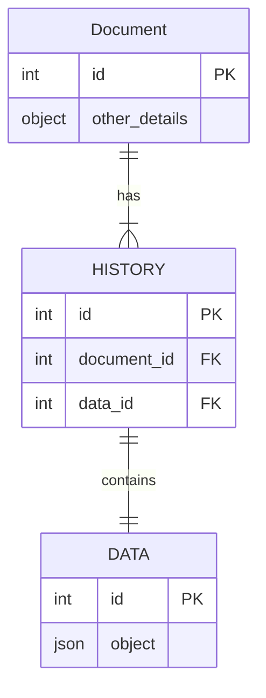

# Overview

If you’ve landed here, hopefully you’re looking for help getting data flowing from a Node.js and Express web application, to a PostgreSQL database with Sequelize as the O.R.M. This guide will assist you with setting up a Node.js project, and installing Sequelize to allow for object relational database mapping between a Postgres database.

> “**Sequelize** is a promise-based Node.js ORM for Postgres, MySQL, MariaDB, SQLite and Microsoft SQL Server.” — sequelize.org

Before we get moving, let me lay out the tools we’ll be using. This way you have a high-level sense of what tools you should be knowledgeable of, and what you can expect to extract from this guide.


## Tools

-   [Node.js](https://nodejs.org/en/download/)  🎛
-   [Sequelize](https://sequelize.org/master/manual/getting-started.html)  📝
-   [Postgres](https://www.postgresql.org/download/)  🗄 (I’m using  [Postgres.app](https://postgresapp.com/)  for mac)
-   [Postico](https://eggerapps.at/postico/)  🔍 (or any DB viewer for Postgres)
-   [VS Code](https://code.visualstudio.com/)  💻


## Project Dependencies

-   express 👂🏼
-   dotenv 🔐
-   nodemon 🔁
-   sequelize-cli 🗺

## Prerequisites

To have the most success using this guide you should have a general  **_command of JavaScript_**. You also  **_need to have_**  [**_Node.js_**](https://nodejs.org/en/download/) _and_ [**_PostgreSQL_**](https://www.postgresql.org/download/) **_installed_**  on your machine

## Tables used

- Data

```json
CREATE TABLE "Data" (
id integer DEFAULT nextval('"Data_id_seq"'::regclass) PRIMARY KEY,
data json,
"createdAt" timestamp with time zone NOT NULL,
"updatedAt" timestamp with time zone NOT NULL
);
```

- Document
```json
CREATE  TABLE  "Document" (
id integer DEFAULT nextval('"Document_id_seq"'::regclass) PRIMARY KEY,
"partId"  character  varying(255),
"partName"  character  varying(255),
"altPartId"  character  varying(255),
"isShippableFG"  character  varying(255),
"parentPartId"  character  varying(255),
"partType"  character  varying(255),
"supplySource"  character  varying(255),
"hsnCode"  character  varying(255),
client character varying(255),
"partDoc"  character  varying(255),
"createdAt"  timestamp  with  time  zone  NOT  NULL,
"updatedAt"  timestamp  with  time  zone  NOT  NULL
);
```
- DocumentHistory
```json
CREATE  TABLE  "DocumentHistory" (
id integer DEFAULT nextval('"DocumentHistory_id_seq"'::regclass) PRIMARY KEY,
"docId"  integer  REFERENCES  "Document"(id),
revisionid bigint,
description character varying(255),
"preparedBy"  character  varying(255),
"approvedBy"  character  varying(255),
"approvedDate"  timestamp  with  time  zone,
data integer REFERENCES "Data"(id),
"createdAt"  timestamp  with  time  zone  NOT  NULL,
"updatedAt"  timestamp  with  time  zone  NOT  NULL
);
```


## Rest Endpoint


* [Show all Documents](/documents) : `GET /documents`
  Response
    ```json
    {
    "document": [
        {
        "id": 1,
        "partId": "BGH564W9",
        "partName": "Fork Level Assembly",
        "altPartId": "1413",
        "isShippableFG": "No",
        "parentPartId": "BGH564W9",
        "partType": "Assembly",
        "supplySource": "In House",
        "hsnCode": "1413",
        "client": "-",
        "partDoc": "e-DOC",
        "createdAt": "2022-08-06T16:38:02.218Z",
        "updatedAt": "2022-08-06T16:38:02.218Z"
        }
    ]
    }
    ```
   

* [Details of a Document](/api/documents:id) : `GET /api/documents:id`
   Response
  ```json
    {
  "id": 1,
  "partId": "BGH564W9",
  "partName": "Fork Level Assembly",
  "altPartId": "1413",
  "isShippableFG": "No",
  "parentPartId": "BGH564W9",
  "partType": "Assembly",
  "supplySource": "In House",
  "hsnCode": "1413",
  "client": "-",
  "partDoc": "e-DOC",
  "createdAt": "2022-08-06T16:38:02.218Z",
  "updatedAt": "2022-08-06T16:38:02.218Z",
  "revisions": [
    {
      "id": 18,
      "docId": 1,
      "revisionid": "1",
      "description": "Sample",
      "preparedBy": "current User",
      "approvedBy": null,
      "approvedDate": null,
      "data": 29,
      "createdAt": "2022-08-07T13:52:48.579Z",
      "updatedAt": "2022-08-07T13:52:48.579Z"
    },
    {
      "id": 19,
      "docId": 1,
      "revisionid": "2",
      "description": "Sample",
      "preparedBy": "current User",
      "approvedBy": null,
      "approvedDate": null,
      "data": 30,
      "createdAt": "2022-08-07T13:52:56.435Z",
      "updatedAt": "2022-08-07T13:52:56.435Z"
    }
  ]
    }
  ```
* [All Revisions of a Document](/api/documents:id/revisions) : `GET /api/documents:id/revisions`
   Response
   ```json
   {
  "document": [
    {
      "id": 18,
      "docId": 1,
      "revisionid": "1",
      "description": "Sample",
      "preparedBy": "current User",
      "approvedBy": null,
      "approvedDate": null,
      "data": 29,
      "createdAt": "2022-08-07T13:52:48.579Z",
      "updatedAt": "2022-08-07T13:52:48.579Z"
    },
    {
      "id": 19,
      "docId": 1,
      "revisionid": "2",
      "description": "Sample",
      "preparedBy": "current User",
      "approvedBy": null,
      "approvedDate": null,
      "data": 30,
      "createdAt": "2022-08-07T13:52:56.435Z",
      "updatedAt": "2022-08-07T13:52:56.435Z"
    }
    ]
    }
  ```
* [Add Revision for a Document](/api/documents:id/revisions) : `POST  /api/documents:id/revisions`
  * Request
   ```json
   {
        "description": "Sample",
        "preparedBy": "current User",
        "data": {
            "key": "value"
        }
    }   
   ```
   * Response
   ```json
   {
    "docHistory": {
        "id": 19,
        "description": "Sample",
        "preparedBy": "current User",
        "data": 30,
        "docId": 1,
        "revisionid": "2",
        "updatedAt": "2022-08-07T13:52:56.435Z",
        "createdAt": "2022-08-07T13:52:56.435Z",
        "approvedBy": null,
        "approvedDate": null
    }
    }
   ```
* [Details of a revision](/api/documents:id/revisions/:revid) : `GET  /api/documents:id/revisions/:revid`
  * Response
   ```json
  {
  "id": 18,
  "docId": 1,
  "revisionid": "1",
  "description": "Sample",
  "preparedBy": "current User",
  "approvedBy": null,
  "approvedDate": null,
  "data": 29,
  "createdAt": "2022-08-07T13:52:48.579Z",
  "updatedAt": "2022-08-07T13:52:48.579Z",
  "diagram": {
    "id": 29,
    "data": {
      "key": "value"
    },
    "createdAt": "2022-08-07T13:52:48.545Z",
    "updatedAt": "2022-08-07T13:52:48.545Z"
  }
    }
   ```


## How to start the server

```
cd server
npm run dev
```

Default Running on port `8080` can be overwrite by enviornment variable `PORT`
Default enviornment will be `development` can be overwrite by enviornment variable `NODE_ENV` supported `production,development,test`


#### Enviornment Varibale
| Name        | Default Value | Describtion    |
| ----------- | ------------- | -------------- |
| DB_USERNAME |               | username       |
| DB_PASSWORD |               | password       |
| DB_HOST     | localhost     | address        |
| DB_SCHEMA   | bluenetdev    | db schema name |

#### Migration

Can create table using Sequelize migrate
```
npx sequelize-cli db:migrate
```

Undo the changes using Sequelize undo 
```
 npx sequelize-cli db:migrate:undo:all
```